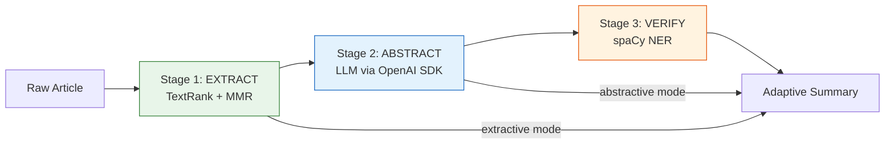
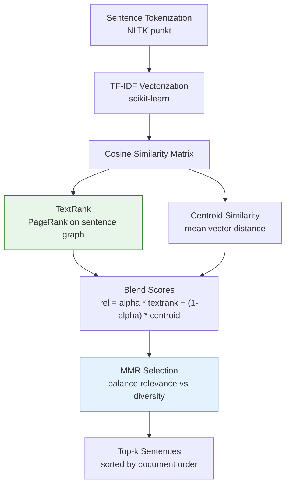
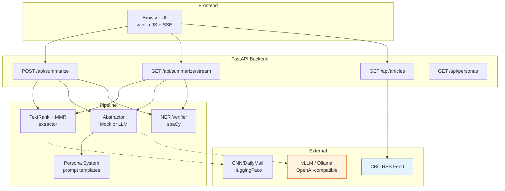

# User-Adaptive Summarization

A three-stage NLP pipeline that produces persona-aware summaries of news articles, with extractive, abstractive, and hybrid modes. Built with FastAPI, spaCy, and an OpenAI-compatible LLM backend.

COMP385-402 Capstone Project, Group 4, Centennial College, Winter 2026.

---

## Architecture

### Three-Stage Pipeline



### Core Algorithm (TextRank + MMR)



### System Overview



---

## Features

- **Three pipeline modes**: extractive (TextRank+MMR only), abstractive (LLM rewrite), hybrid (extract + abstract + verify)
- **Persona system**: technical, casual, executive, academic profiles shape LLM prompt and output style
- **Length control**: brief, standard, detailed options that scale the LLM token budget
- **SSE streaming**: token-by-token delivery for abstractive/hybrid via `EventSource`
- **NER verification**: spaCy-based factual consistency check with confidence scoring and flagged entity reporting
- **ROUGE evaluation**: reproducible eval script on CNN/DailyMail test split
- **Mock-first design**: runs fully offline with `MockAbstractor`; real LLM opt-in via env vars
- **CI/CD**: GitHub Actions pipeline with lint (ruff), type check (mypy), and test (pytest) on every push

---

## Roadmap

### Milestone 1: Foundation + Pipeline + Streaming
> Code-complete. Pending end-to-end validation with live LLM.

- [x] **Phase 1: Testing Scaffold, CI/CD, and Docker**
  - `pyproject.toml` with ruff, mypy, pytest, and coverage config
  - 66 tests across 7 modules (summarizer, evaluator, API, data pipeline, dataset loader, trainer)
  - 85% coverage on core modules
  - GitHub Actions CI pipeline (lint + test jobs)
  - Multi-stage `Dockerfile` + `docker-compose.yml`
  - `Makefile` with dev, test, lint, docker targets
  - Modernized type annotations, mypy strict with zero errors
  - Tag: `phase-1-complete`

- [x] **Phase 2: Hybrid Summarization Pipeline + Persona System**
  - Three-stage pipeline: extract (TextRank+MMR) -> abstract (LLM) -> verify (NER)
  - 5 persona profiles with prompt templates and length control
  - `MockAbstractor` for offline dev, real `Abstractor` via OpenAI SDK
  - NER-based factual consistency checker (spaCy `en_core_web_sm`)
  - `POST /api/summarize` now accepts `mode`, `persona`, `length` params
  - `GET /api/personas` endpoint
  - Backward compatible: old requests default to extractive mode
  - Graceful fallback: abstractor failure returns extractive result
  - 140 tests, 89% coverage
  - Tag: `phase-2-complete`

- [x] **Phase 3: Frontend Refresh, SSE Streaming, and Eval Artifacts**
  - `GET /api/summarize/stream` SSE endpoint with `StreamingResponse`
  - `generate_stream()` on abstractor layer (base splits by word, real uses SDK `stream=True`)
  - `run_stream()` on pipeline layer yielding SSE events (meta, token, done, error)
  - Frontend: mode toggle, persona dropdown, length selector, confidence badge, flagged entity chips, latency timer
  - Replaced old untested eval script with standalone CLI (`eval/run_eval.py`)
  - `make eval` target
  - 168 tests, 88% coverage
  - Tag: `phase-3-complete`

### Milestone 2: Intelligence + Deployment
> Planned. Hardware setup in progress.

- [ ] **Phase 4: vLLM Integration, Embeddings, User Profiles + Feedback**
  - Validate real LLM path with vLLM on RTX 3090
  - Sentence embeddings (`all-MiniLM-L6-v2`) replacing TF-IDF for semantic similarity
  - Position bias scoring for news articles (inverted pyramid)
  - User profile model with stored preferences (topics, keywords, persona defaults)
  - Article ranking system (topic similarity + keyword match + recency scoring)
  - Feedback loop (like/dislike per summary, adjusts ranking)
  - New endpoints: `/api/user/preferences`, `/api/user/feedback`, `/api/articles/personalized`
  - Baseline ROUGE evaluation results committed to `eval/results/`
  - BERTScore evaluation alongside ROUGE

- [ ] **Phase 5: k3s Deployment, GitOps, Frontend Rewrite, Monitoring**
  - k3s manifests: vLLM deployment, API deployment, services, ingress
  - NVIDIA GPU Operator for GPU scheduling
  - ArgoCD GitOps (auto-deploy on merge to main)
  - Svelte frontend replacing vanilla JS
  - Prometheus + Grafana for inference metrics (tok/s, latency, GPU utilization)
  - Helm chart for the full stack
  - Comparative eval: extractive vs hybrid vs pure LLM
  - Side-by-side comparison view in frontend

---

## Quick Start

```bash
# 1. clone and install
git clone https://github.com/ixxet/User-Adaptive-Summarization_COMP385-402_Group-4_Winter2026.git
cd User-Adaptive-Summarization_COMP385-402_Group-4_Winter2026
git checkout rouge-one
pip install -e ".[dev]"
python -m spacy download en_core_web_sm

# 2. start the dev server
make dev

# 3. open the frontend
#    http://localhost:8000/frontend/index.html
```

---

## Runbook

### Development server

```bash
make dev                   # uvicorn on port 8000 with hot-reload
```

The API serves both REST endpoints and the static frontend at `/frontend/index.html`.

### Test suite

```bash
make test                  # run all 168 tests with coverage report
make lint                  # ruff lint + mypy type check
make typecheck             # mypy only
```

### ROUGE evaluation

```bash
make eval                              # default: 50 samples, seed=42
python -m eval.run_eval --samples 100  # custom sample count
python -m eval.run_eval --output results/my_run.json
```

Downloads CNN/DailyMail test split on first run, then caches locally.

### Docker

```bash
make docker-build          # build the container image
make docker-run            # start via docker-compose on port 8000
```

### Connect to a real LLM (vLLM or Ollama)

```bash
# set env vars before starting the server
export USE_MOCK_LLM=0
export VLLM_BASE_URL=http://localhost:8001/v1
export VLLM_API_KEY=your-key-here

make dev
```

Then use `mode=hybrid` or `mode=abstractive` in API requests to route through the LLM.

---

## Project Structure

```
.
├── api.py                    FastAPI backend (REST + SSE endpoints)
├── Makefile                  dev, test, lint, eval, docker targets
├── pyproject.toml            build config, tool settings (ruff, mypy, pytest)
├── requirements.txt          pinned dependencies
│
├── src/
│   ├── summarizer_model.py   TextRank + MMR extractive engine (core algorithm)
│   ├── pipeline.py           three-stage orchestrator + SSE streaming
│   ├── personas.py           persona definitions and prompt builder
│   ├── abstractor.py         LLM abstraction layer (mock + real via OpenAI SDK)
│   ├── verifier.py           NER-based factual consistency checker (spaCy)
│   ├── evaluator.py          ROUGE scoring
│   ├── dataset_loader.py     CNN/DailyMail dataset loader (HuggingFace)
│   ├── trainer.py            hyperparameter tuning for extractive config
│   └── data_pipeline.py      RSS ingestion + text normalization
│
├── frontend/
│   └── index.html            vanilla JS frontend with SSE streaming
│
├── eval/
│   ├── run_eval.py           reproducible evaluation CLI (argparse + JSON output)
│   └── results/              saved evaluation outputs
│
├── tests/                    168 tests, 88% coverage
│   ├── conftest.py           shared fixtures and sample data
│   ├── test_summarizer.py    TextRank scoring, MMR selection, edge cases
│   ├── test_summarization_pipeline.py   all 3 modes + streaming + errors
│   ├── test_abstractor.py    mock/real abstractor, config, streaming
│   ├── test_verifier.py      NER extraction, confidence, graceful fallback
│   ├── test_personas.py      persona definitions, prompt formatting
│   ├── test_api.py           all endpoints including SSE stream
│   ├── test_eval.py          evaluation script and CLI
│   ├── test_data_pipeline.py normalization, tokenization, RSS fetch
│   ├── test_dataset_loader.py CNN/DailyMail loader
│   ├── test_evaluator.py     ROUGE evaluator
│   └── test_trainer.py       hyperparameter tuning
│
├── .github/workflows/
│   └── ci.yml                lint + test on push (GitHub Actions)
│
├── Dockerfile                multi-stage build for the API
└── docker-compose.yml        single-service local deploy
```

---

## API Reference

| Method | Endpoint | Description |
|--------|----------|-------------|
| `GET` | `/api/health` | Health check |
| `GET` | `/api/articles` | Fetch CBC RSS articles |
| `GET` | `/api/personas` | List available persona names |
| `POST` | `/api/summarize` | Summarize an article (JSON body) |
| `GET` | `/api/summarize/stream` | SSE streaming summary (query params) |

### POST /api/summarize

```json
{
  "url": "https://example.com/article",
  "k": 5,
  "mode": "hybrid",
  "persona": "executive",
  "length": "brief"
}
```

Response includes `summary`, `mode`, `persona`, and for hybrid/abstractive modes: `confidence` (0.0-1.0) and `flagged_entities`.

### GET /api/summarize/stream

Query params: `url`, `k`, `mode`, `persona`, `length`.

Returns `text/event-stream` with event types:
- `event: meta` - pipeline mode and persona
- `event: token` - individual tokens as they generate
- `event: done` - final summary with confidence and flagged entities
- `event: error` - error message if something fails

---

## Extractive Algorithm

The extractive stage uses TextRank for importance scoring with cosine similarity on TF-IDF vectors, blended with centroid similarity for stability on short articles. MMR (Maximal Marginal Relevance) selects the final top-k sentences to balance relevance against diversity.

| Parameter | Default | Effect |
|-----------|---------|--------|
| `mmr_lambda` | 0.75 | Higher = less redundancy penalty |
| `blend_alpha` | 0.7 | Higher = more TextRank influence |
| `textrank_min_edge` | 0.1 | Higher = sparser similarity graph |

---

## Environment Variables

| Variable | Default | Description |
|----------|---------|-------------|
| `USE_MOCK_LLM` | `1` | Set to `0` to use a real LLM backend |
| `VLLM_BASE_URL` | `http://localhost:8000/v1` | OpenAI-compatible endpoint for the LLM |
| `VLLM_API_KEY` | `EMPTY` | API key for the LLM backend |
| `RSS_FEED_URL` | CBC Business RSS | Default RSS feed for article fetching |

---

## Current Numbers

| Metric | Value |
|--------|-------|
| Tests | 168 |
| Coverage | 88% |
| Pipeline modes | 3 (extractive, abstractive, hybrid) |
| Personas | 5 (default, technical, casual, executive, academic) |
| API endpoints | 6 |
| CI | GitHub Actions (ruff + mypy + pytest) |
| Frontend controls | 5 (article, k, mode, persona, length) |
