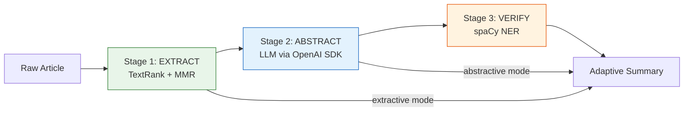
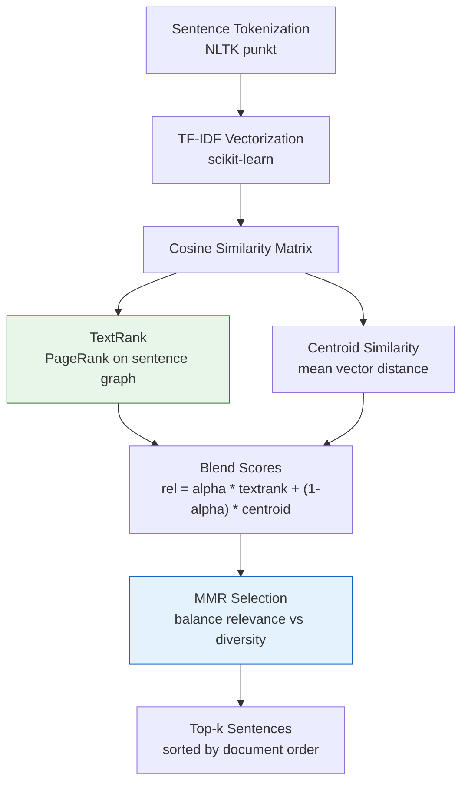
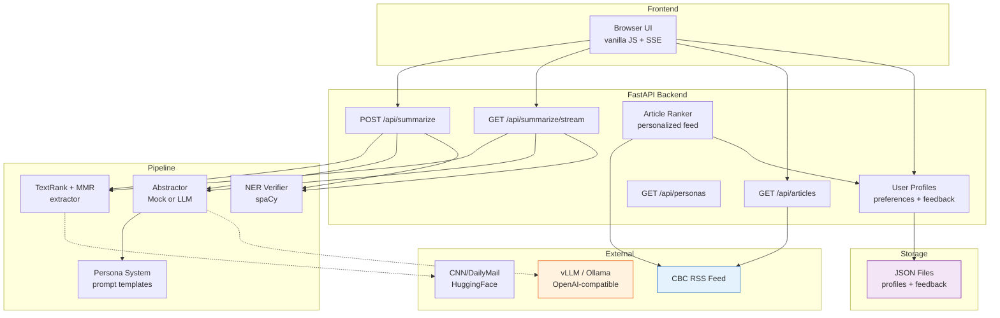

# User-Adaptive Summarization

[](https://github.com/ixxet/User-Adaptive-Summarization_COMP385-402_Group-4_Winter2026/actions)


A three-stage NLP pipeline that produces persona-aware summaries of news articles, with extractive, abstractive, and hybrid modes. Built with FastAPI, SvelteKit, spaCy, and an OpenAI-compatible LLM backend (vLLM/Mistral-7B on RTX 3090).

COMP385-402 Capstone Project, Group 4, Centennial College, Winter 2026.

---

## Architecture

### Three-Stage Pipeline



### Core Algorithm (TextRank + MMR)



### System Overview



---

## Features

- **Three pipeline modes**: extractive (TextRank+MMR only), abstractive (LLM rewrite), hybrid (extract + abstract + verify)
- **Persona system**: technical, casual, executive, academic profiles shape LLM prompt and output style
- **Length control**: brief, standard, detailed options that scale the LLM token budget
- **SSE streaming**: token-by-token delivery for abstractive/hybrid via `EventSource`
- **NER verification**: spaCy-based factual consistency check with confidence scoring and flagged entity reporting
- **Dual evaluation**: ROUGE (lexical overlap) and BERTScore (semantic similarity) on CNN/DailyMail test split
- **Mock-first design**: runs fully offline with `MockAbstractor`; real LLM opt-in via env vars
- **CI/CD**: GitHub Actions pipeline with lint (ruff), type check (mypy), and test (pytest) on every push

---

## Roadmap

### Milestone 1: Foundation + Pipeline + Streaming
> Code-complete. Pending end-to-end validation with live LLM.

- [x] **Phase 1: Testing Scaffold, CI/CD, and Docker**
  - `pyproject.toml` with ruff, mypy, pytest, and coverage config
  - 66 tests across 7 modules (summarizer, evaluator, API, data pipeline, dataset loader, trainer)
  - 85% coverage on core modules
  - GitHub Actions CI pipeline (lint + test jobs)
  - Multi-stage `Dockerfile` + `docker-compose.yml`
  - `Makefile` with dev, test, lint, docker targets
  - Modernized type annotations, mypy strict with zero errors
  - Tag: `phase-1-complete`

- [x] **Phase 2: Hybrid Summarization Pipeline + Persona System**
  - Three-stage pipeline: extract (TextRank+MMR) -> abstract (LLM) -> verify (NER)
  - 5 persona profiles with prompt templates and length control
  - `MockAbstractor` for offline dev, real `Abstractor` via OpenAI SDK
  - NER-based factual consistency checker (spaCy `en_core_web_sm`)
  - `POST /api/summarize` now accepts `mode`, `persona`, `length` params
  - `GET /api/personas` endpoint
  - Backward compatible: old requests default to extractive mode
  - Graceful fallback: abstractor failure returns extractive result
  - 140 tests, 89% coverage
  - Tag: `phase-2-complete`

- [x] **Phase 3: Frontend Refresh, SSE Streaming, and Eval Artifacts**
  - `GET /api/summarize/stream` SSE endpoint with `StreamingResponse`
  - `generate_stream()` on abstractor layer (base splits by word, real uses SDK `stream=True`)
  - `run_stream()` on pipeline layer yielding SSE events (meta, token, done, error)
  - Frontend: mode toggle, persona dropdown, length selector, confidence badge, flagged entity chips, latency timer
  - Replaced old untested eval script with standalone CLI (`eval/run_eval.py`)
  - `make eval` target
  - 168 tests, 88% coverage
  - Tag: `phase-3-complete`

### Milestone 2: Intelligence + Deployment
> Planned. Hardware setup in progress.

- [x] **Phase 4: User Profiles, Feedback, and Evaluation**
  - [x] User profile model with JSON-backed persistence (topics, keywords, persona defaults)
  - [x] Article ranking system (topic similarity + keyword match + feedback weight scoring)
  - [x] Feedback loop (like/dislike per summary, adjusts profile weights over time)
  - [x] New endpoints: `/api/user/preferences`, `/api/user/feedback`, `/api/articles/personalized`
  - [x] Existing `/api/summarize` accepts optional `user_id` for profile-driven defaults
  - [x] BERTScore evaluator alongside ROUGE (opt-in via `--bertscore`)
  - [x] Baseline evaluation results committed to `eval/results/`
  - [x] Inline comments pass across all modules
  - [x] Validate real LLM path with vLLM on RTX 3090 (Mistral-7B-Instruct-v0.3, all modes + personas verified)
  - Algorithm upgrades (sentence embeddings, position bias) deferred pending team discussion
  - 223 tests, 91% coverage
  - Tag: `phase-4-complete`

- [x] **Phase 5: Kubernetes Deployment, GitOps, Frontend Rewrite, Monitoring**
  - [x] SvelteKit frontend: 4 pages, 9 components, 3 reactive stores, all 10 endpoints wired
  - [x] Component-to-API architecture diagram (`docs/svelte-frontend.mmd`)
  - [x] Flux kustomizations for Talos k8s cluster (vLLM, API, services, Cilium ingress)
  - [x] NVIDIA device plugin GPU request for RTX 3090
  - [x] Flux GitRepository + Kustomization for GitOps reconciliation
  - [x] Prometheus ServiceMonitors + Grafana dashboard (tok/s, cache, GPU util, uptime)
  - [x] Comparative eval: extractive vs abstractive vs hybrid on live Mistral-7B (20 samples)
  - [x] Portfolio polish: CI badges, test/coverage shields, updated README
  - Tag: `phase-5-complete`

---

## Quick Start

```bash
# 1. clone and install
git clone https://github.com/ixxet/User-Adaptive-Summarization_COMP385-402_Group-4_Winter2026.git
cd User-Adaptive-Summarization_COMP385-402_Group-4_Winter2026
git checkout rouge-one
pip install -e ".[dev]"
python -m spacy download en_core_web_sm

# 2. start the dev server
make dev

# 3. open the frontend
#    http://localhost:8000/frontend/index.html
```

---

## Runbook

### Development server

```bash
make dev                   # uvicorn on port 8000 with hot-reload
```

The API serves both REST endpoints and the static frontend at `/frontend/index.html`.

### Test suite

```bash
make test                  # run all 223 tests with coverage report
make lint                  # ruff lint + mypy type check
make typecheck             # mypy only
```

### Evaluation

```bash
make eval                                        # ROUGE only, 50 samples, seed=42
python -m eval.run_eval --samples 100            # custom sample count
python -m eval.run_eval --bertscore              # ROUGE + BERTScore (needs torch)
python -m eval.run_eval --output results/run.json
```

Downloads CNN/DailyMail test split on first run, then caches locally.
BERTScore requires `torch` and loads DeBERTa-xlarge-mnli (~700MB) on first run.

### Svelte frontend (development)

```bash
cd web
npm install                   # first time only
npm run dev                   # Vite dev server on :5173, proxies /api to FastAPI
```

Run `make dev` in a separate terminal so the API is available. The Vite dev server proxies all `/api/*` requests to `localhost:8000`.

### Svelte frontend (production build)

```bash
cd web
npm run build                 # builds static files to frontend/
```

The `adapter-static` output replaces the contents of `frontend/` so FastAPI serves the built app at `/frontend/index.html`.

### Docker

```bash
make docker-build          # build the container image
make docker-run            # start via docker-compose on port 8000
```

### Connect to a real LLM (vLLM or Ollama)

```bash
# set env vars before starting the server
export USE_MOCK_LLM=0
export VLLM_BASE_URL=http://localhost:8001/v1
export VLLM_API_KEY=your-key-here

make dev
```

Then use `mode=hybrid` or `mode=abstractive` in API requests to route through the LLM.

---

## Project Structure

```
.
├── api.py                    FastAPI backend (REST + SSE endpoints)
├── Makefile                  dev, test, lint, eval, docker targets
├── pyproject.toml            build config, tool settings (ruff, mypy, pytest)
├── requirements.txt          pinned dependencies
│
├── src/
│   ├── summarizer_model.py   TextRank + MMR extractive engine (core algorithm)
│   ├── pipeline.py           three-stage orchestrator + SSE streaming
│   ├── personas.py           persona definitions and prompt builder
│   ├── abstractor.py         LLM abstraction layer (mock + real via OpenAI SDK)
│   ├── verifier.py           NER-based factual consistency checker (spaCy)
│   ├── evaluator.py          ROUGE + BERTScore evaluation
│   ├── dataset_loader.py     CNN/DailyMail dataset loader (HuggingFace)
│   ├── trainer.py            hyperparameter tuning for extractive config
│   ├── user_profile.py       user preference model + JSON storage
│   ├── article_ranker.py     ranks articles by user profile relevance
│   ├── feedback.py           like/dislike collection + profile weight adjustment
│   └── data_pipeline.py      RSS ingestion + text normalization
│
├── frontend/
│   └── index.html            legacy vanilla JS frontend (replaced by Svelte)
│
├── web/                      SvelteKit frontend (source)
│   ├── package.json          dependencies and build scripts
│   ├── svelte.config.js      adapter-static config (builds to frontend/)
│   ├── vite.config.ts        dev server proxy to FastAPI
│   └── src/
│       ├── app.html          HTML shell
│       ├── app.css           global theme (purple/burgundy dark palette)
│       ├── lib/
│       │   ├── api.ts        typed fetch wrappers for all 10 endpoints
│       │   ├── types.ts      shared TypeScript interfaces
│       │   ├── stores/       reactive state (user, articles, summary)
│       │   └── components/   9 shared Svelte components
│       └── routes/
│           ├── +layout.svelte   navbar + toast shell
│           ├── +page.svelte     / dashboard
│           ├── summarize/       /summarize workspace
│           ├── profile/         /profile preferences
│           └── compare/         /compare side-by-side
│
├── eval/
│   ├── run_eval.py           reproducible evaluation CLI (argparse + JSON output)
│   └── results/              saved evaluation outputs (baseline + comparative)
│
├── k8s/
│   ├── base/                 kustomize base: namespace, deployments, services, ingress
│   │   ├── kustomization.yaml
│   │   ├── vllm-deployment.yaml   Mistral-7B on RTX 3090 (GPU request)
│   │   ├── api-deployment.yaml    FastAPI backend (2 replicas)
│   │   └── ingress.yaml           Cilium ingress at summarizer.local
│   ├── monitoring/
│   │   ├── api-servicemonitor.yaml    Prometheus scrape for API
│   │   ├── vllm-servicemonitor.yaml   Prometheus scrape for vLLM /metrics
│   │   └── grafana-dashboard.json     7-panel dashboard (tok/s, cache, GPU)
│   ├── flux-source.yaml       GitRepository pointing at ixxet fork
│   └── flux-kustomization.yaml  Flux reconciliation config
│
├── tests/                    223 tests, 91% coverage
│   ├── conftest.py           shared fixtures and sample data
│   ├── test_summarizer.py    TextRank scoring, MMR selection, edge cases
│   ├── test_summarization_pipeline.py   all 3 modes + streaming + errors
│   ├── test_abstractor.py    mock/real abstractor, config, streaming
│   ├── test_verifier.py      NER extraction, confidence, graceful fallback
│   ├── test_personas.py      persona definitions, prompt formatting
│   ├── test_api.py           all endpoints including SSE stream
│   ├── test_eval.py          evaluation CLI (ROUGE + BERTScore flag)
│   ├── test_user_profile.py  profile CRUD, persistence, corruption recovery
│   ├── test_article_ranker.py topic/keyword/feedback scoring, sort stability
│   ├── test_feedback.py      feedback recording, apply_feedback weight adjustment
│   ├── test_data_pipeline.py normalization, tokenization, RSS fetch
│   ├── test_dataset_loader.py CNN/DailyMail loader
│   ├── test_evaluator.py     ROUGE + BERTScore evaluators
│   └── test_trainer.py       hyperparameter tuning
│
├── .github/workflows/
│   └── ci.yml                lint + test on push (GitHub Actions)
│
├── Dockerfile                multi-stage build for the API
└── docker-compose.yml        single-service local deploy
```

---

## API Reference

| Method | Endpoint | Description |
|--------|----------|-------------|
| `GET` | `/api/health` | Health check |
| `GET` | `/api/articles` | Fetch CBC RSS articles |
| `GET` | `/api/personas` | List available persona names |
| `POST` | `/api/summarize` | Summarize an article (JSON body) |
| `GET` | `/api/summarize/stream` | SSE streaming summary (query params) |
| `POST` | `/api/user/preferences` | Create/update user profile |
| `GET` | `/api/user/preferences/{user_id}` | Get user preferences |
| `POST` | `/api/user/feedback` | Record like/dislike on a summary |
| `GET` | `/api/articles/personalized` | Ranked articles for a user profile |

### POST /api/summarize

```json
{
  "url": "https://example.com/article",
  "k": 5,
  "mode": "hybrid",
  "persona": "executive",
  "length": "brief"
}
```

Response includes `summary`, `mode`, `persona`, and for hybrid/abstractive modes: `confidence` (0.0-1.0) and `flagged_entities`.

### GET /api/summarize/stream

Query params: `url`, `k`, `mode`, `persona`, `length`.

Returns `text/event-stream` with event types:
- `event: meta` - pipeline mode and persona
- `event: token` - individual tokens as they generate
- `event: done` - final summary with confidence and flagged entities
- `event: error` - error message if something fails

### POST /api/user/preferences

```json
{
  "user_id": "demo",
  "preferred_topics": ["AI", "finance"],
  "keywords": ["startup", "GPU"],
  "default_persona": "technical",
  "default_length": "brief"
}
```

### POST /api/user/feedback

```json
{
  "user_id": "demo",
  "article_title": "AI Startups Raise Record Funding",
  "persona": "technical",
  "mode": "hybrid",
  "liked": true
}
```

Feedback adjusts the user's profile weights automatically. Liked article topics get boosted in future rankings, disliked topics get slightly penalized.

### GET /api/articles/personalized?user_id=demo

Returns the same articles as `/api/articles` but scored and sorted by relevance to the user's profile. Each article includes a `score` and `match_reasons` array.

---

## Extractive Algorithm

The extractive stage uses TextRank for importance scoring with cosine similarity on TF-IDF vectors, blended with centroid similarity for stability on short articles. MMR (Maximal Marginal Relevance) selects the final top-k sentences to balance relevance against diversity.

| Parameter | Default | Effect |
|-----------|---------|--------|
| `mmr_lambda` | 0.75 | Higher = less redundancy penalty |
| `blend_alpha` | 0.7 | Higher = more TextRank influence |
| `textrank_min_edge` | 0.1 | Higher = sparser similarity graph |

---

## Environment Variables

| Variable | Default | Description |
|----------|---------|-------------|
| `USE_MOCK_LLM` | `1` | Set to `0` to use a real LLM backend |
| `VLLM_BASE_URL` | `http://localhost:8000/v1` | OpenAI-compatible endpoint for the LLM |
| `VLLM_API_KEY` | `EMPTY` | API key for the LLM backend |
| `RSS_FEED_URL` | CBC Business RSS | Default RSS feed for article fetching |

---

## Evaluation Results

### Extractive Baseline (50 samples, seed=42, k=5)

| Metric | Score |
|--------|-------|
| ROUGE-1 F1 | 0.324 |
| ROUGE-2 F1 | 0.125 |
| ROUGE-L F1 | 0.208 |

Competitive for an unsupervised extractive method -- no training data or fine-tuning involved.

### Comparative: Extractive vs Abstractive vs Hybrid

20 CNN/DailyMail test samples, Mistral-7B-Instruct-v0.3 on RTX 3090 via vLLM:

| Metric | Extractive | Abstractive | Hybrid |
|--------|-----------|-------------|--------|
| ROUGE-1 F1 | 0.325 | 0.325 | **0.339** |
| ROUGE-2 F1 | **0.128** | 0.103 | 0.105 |
| ROUGE-L F1 | **0.215** | 0.200 | 0.205 |
| Avg NER Confidence | N/A | N/A | 0.861 |

**Key observations:**
- **Hybrid leads ROUGE-1** by +1.4 points over extractive -- the LLM rewrite introduces better unigram coverage while the NER verify step catches hallucinations
- **Extractive leads ROUGE-2/L** -- extractive copies sentences verbatim from the article, so bigram and longest-common-subsequence overlap is naturally higher
- **Abstractive matches extractive on R1** but trades R2 precision for paraphrasing (expected behavior -- it uses different words to say the same thing)
- **NER verification works** -- average confidence of 0.861 means the verifier catches hallucinated entities without being overly aggressive. Samples with conf < 0.7 had the LLM inventing dates or expanding abbreviations

BERTScore evaluation is available via `--bertscore` for semantic similarity (expected to favor abstractive/hybrid since it captures meaning beyond lexical overlap).

Full results: `eval/results/baseline_mock_20260326.json`, `eval/results/comparative_20260326.json`.

---

## Challenges and Growing Pains

Real-world problems we hit during development and how we dealt with them.

### Extractive model limitations

TextRank+MMR is fast and training-free, but it has known blind spots:
- **Lead bias**: news articles front-load important information, and TextRank often over-selects early sentences. The centroid blending (`blend_alpha=0.7`) helps, but doesn't fully eliminate it.
- **Redundancy in similar sentences**: MMR with `lambda=0.75` penalizes redundancy, but two sentences that say the same thing with different words can still both get selected because TF-IDF doesn't capture semantic similarity.
- **Short article collapse**: articles under ~5 sentences produce a near-trivial similarity matrix. The `minmax` normalization handles the degenerate case, but the "summary" is basically the whole article.

These are addressable with sentence-transformer embeddings and position-aware scoring, but those changes are deferred pending team discussion to avoid disrupting the existing algorithm.

### Mock vs real LLM gap

The `MockAbstractor` is deterministic and fast, which is great for CI, but it produces summaries that are just the first 3 extracted sentences glued together. This means:
- ROUGE scores from mock runs reflect extractive quality, not abstractive quality
- Streaming tests verify the SSE protocol but not actual token generation timing
- Persona styling has zero effect in mock mode (the prompt is ignored)

The comparative evaluation (see results above) confirms this gap: hybrid ROUGE-1 is only +1.4 points over extractive on CNN/DailyMail, partly because ROUGE penalizes paraphrasing. BERTScore would give a fairer picture of semantic quality.

### NER verification false positives

The spaCy `en_core_web_sm` model flags entities that are technically valid but look suspicious:
- Abbreviations the LLM introduces (e.g., "WHO" expanded to "World Health Organization" gets flagged because the exact string wasn't in the source)
- Possessive forms ("Canada's" vs "Canada") fail the exact-match comparison
- Common words incorrectly tagged as entities by the small model

We normalize with lowercase + strip, which helps, but a more robust approach would use entity linking or a larger spaCy model. The current setup is good enough for a confidence signal, not a hard filter.

### vLLM network reachability

The Prometheus cluster (Talos k8s, RTX 3090, vLLM serving Mistral-7B-Instruct-v0.3 at `192.168.2.205:8000/v1`) is on a home lab network. During development:
- The cluster is only reachable from the home LAN (ICMP blocked by Talos, but HTTP works)
- Campus/public WiFi requires Tailscale to reach the endpoint
- vLLM cold starts take ~45s to load the 7B model into GPU memory
- The API defaults to mock mode (`USE_MOCK_LLM=1`) so the entire codebase works without any LLM connectivity
- **Validated**: all 3 pipeline modes (extractive, abstractive, hybrid) and all 4 personas tested against live vLLM. NER verification catches real hallucinations (e.g., Mistral invented "June 2019" when the source said "last June")

Phase 5 will add Flux manifests that deploy the API alongside vLLM in the same cluster, eliminating the network hop issue entirely.

### Evaluation bottlenecks

- CNN/DailyMail downloads ~1.5GB on first run and takes a few seconds to shuffle. Subsequent runs use the HuggingFace cache.
- BERTScore loads DeBERTa-xlarge-mnli (~700MB) and runs inference on every prediction/reference pair. On CPU this takes ~10 minutes for 50 samples. On GPU it drops to under a minute.
- ROUGE scoring is fast (<1s for 50 samples) but only measures lexical overlap, so it undervalues paraphrased summaries that the abstractive mode produces.

The dual-metric approach (ROUGE for lexical, BERTScore for semantic) gives a more complete picture of summary quality.

---

## Current Numbers

| Metric | Value |
|--------|-------|
| Tests | 223 |
| Coverage | 91% |
| Pipeline modes | 3 (extractive, abstractive, hybrid) |
| Personas | 5 (default, technical, casual, executive, academic) |
| API endpoints | 10 |
| Evaluation metrics | ROUGE-1/2/L + BERTScore (P/R/F1) |
| LLM backend | Mistral-7B-Instruct-v0.3 on RTX 3090 via vLLM |
| Frontend | SvelteKit (4 pages, 9 components, SSE streaming) |
| Infrastructure | Talos k8s, Flux GitOps, Cilium CNI, Prometheus + Grafana |
| CI | GitHub Actions (ruff + mypy + pytest) |
| User adaptation | Profiles, ranked articles, feedback loop |
