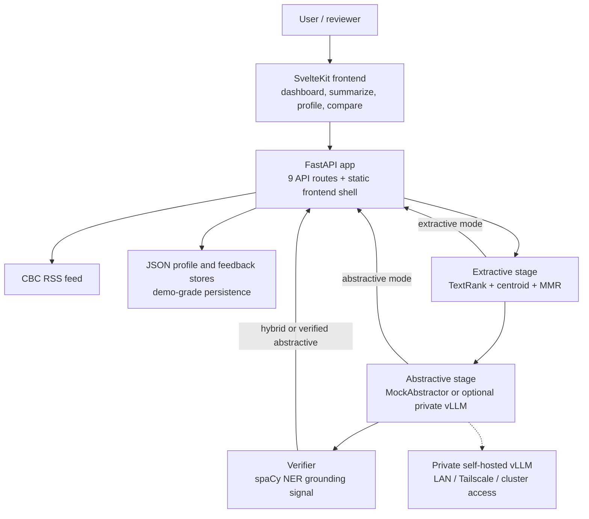

# User-Adaptive Summarization

[](https://github.com/ixxet/User-Adaptive-Summarization_COMP385-402_Group-4_Winter2026/actions)


A portfolio-grade capstone that turns news articles into extractive, abstractive, or hybrid summaries with persona control, lightweight grounding checks, a SvelteKit frontend, and a FastAPI backend that can run fully offline in mock mode or against a private self-hosted vLLM backend.

COMP385-402 Capstone Project, Group 4, Centennial College, Winter 2026.

## What It Is

This project is a multi-mode summarization platform rather than a single-model demo. It combines a custom extractive algorithm, optional LLM rewriting, verification metadata, user profiles, personalized article ranking, streaming output, and deployment scaffolding in one repo.

## Why It Matters

- `extractive`, `abstractive`, and `hybrid` modes expose different accuracy and latency tradeoffs
- persona and length controls shape the rewrite path while extractive mode stays deterministic
- a verifier returns grounding metadata instead of pretending to prove truth
- the app is usable end to end: article feed, summarize workspace, profile controls, compare view
- the repo includes CI, tests, evaluation artifacts, Docker, and Kubernetes manifests

## System Overview



Additional diagrams:
- [Architecture overview](docs/architecture-overview.mmd)
- [Pipeline flow](docs/pipeline-flow.mmd)
- [Extractive algorithm](docs/extractive-algorithm.mmd)
- [Frontend architecture](docs/svelte-frontend.mmd)

## Run Locally

### Portable default: mock mode

This path works for any teammate without access to your private GPU backend.

```bash
git clone https://github.com/ixxet/User-Adaptive-Summarization_COMP385-402_Group-4_Winter2026.git
cd User-Adaptive-Summarization_COMP385-402_Group-4_Winter2026
git checkout rouge-one
pip install -e ".[dev]"
python -m spacy download en_core_web_sm
python -m nltk.downloader punkt punkt_tab
make dev
```

Open [http://localhost:8000/](http://localhost:8000/).

Notes:
- the checked-in Svelte build is served by FastAPI at `/`
- `docker-compose.yml` is API-only; it does not provision vLLM or a separate Svelte dev server
- the web UI uses a fixed default `k=5`; the API still accepts explicit `k` for experiments

### Optional real LLM mode: private backend

This path is for teammates or reviewers who have access to your self-hosted vLLM endpoint over the home LAN, Tailscale, or another private network path.

```bash
USE_MOCK_LLM=0 \
VLLM_BASE_URL=http://<private-host>:8000/v1 \
VLLM_MODEL=mistralai/Mistral-7B-Instruct-v0.3 \
VLLM_API_KEY=EMPTY \
make dev
```

This repo does not claim a public hosted LLM demo. The supported sharing model is:
- everyone can run the full app locally in mock mode
- authorized teammates can point the same app at the private backend when connectivity is available

## Proof It Works

Full regression pass:

```bash
PYTHONPATH=. pytest tests -q
```

Expected result: `244 passed`

Targeted verification hooks:

| Objective | Command | Expected evidence |
| --- | --- | --- |
| Full regression pass | `PYTHONPATH=. pytest tests -q` | `244 passed` |
| Extractive length changes effective sentence budget | `PYTHONPATH=. pytest tests/test_summarization_pipeline.py -q -k "length_scales_effective_k"` | `brief` reduces effective `k`; `detailed` increases it |
| Abstractive mode now surfaces verifier metadata | `PYTHONPATH=. pytest tests/test_summarization_pipeline.py -q -k "confidence_from_verifier_when_available or done_event_has_confidence_when_verifier_available"` | verified abstractive responses return `confidence` and `flagged_entities` |
| Verifier filters citation and reference noise | `PYTHONPATH=. pytest tests/test_verifier.py -q -k "citation_scaffolding_is_filtered or sanitize_text_removes_reference_scaffolding"` | URLs, reference sections, and citation scaffolding are stripped before entity comparison |
| Real LLM path honors configured model name | `PYTHONPATH=. pytest tests/test_abstractor.py -q -k "default_model_from_env"` | runtime reads `VLLM_MODEL` from the environment |

## Verification Semantics

Describe `confidence` as:
- a grounding or consistency signal
- not a truth score
- not an overall summary quality score

Describe `flagged_entities` as:
- entities or details the verifier could not ground in the source
- inspection hints, not proof of hallucination

Recommended wording:

> The verifier provides a lightweight grounding signal rather than a factual guarantee. Its confidence score reflects source-entity consistency, while flagged entities indicate details that warrant manual inspection.

## Project Highlights

- three pipeline modes: extractive, abstractive, hybrid
- five persona profiles: default, technical, casual, executive, academic
- length control for both rewrite budget and extractive sentence budget
- SvelteKit frontend with dashboard, summarize, profile, and compare pages
- FastAPI backend with REST + SSE streaming endpoints
- Prometheus-friendly `/metrics` endpoint for platform monitoring
- user profiles, article ranking, and a feedback loop
- 244 tests, 91% coverage, and GitHub Actions CI
- Talos/Flux/Cilium/Prometheus/Grafana deployment scaffolding for the self-hosted path

## Professional Roadmap

The current branch is submission-ready, but a production-grade version would still need:

- shared persistence so multi-replica personalization is not tied to local JSON files
- a fully replayable comparative evaluation path for live LLM runs
- a stronger verifier than filtered spaCy NER matching
- narrower gap between mock behavior and real LLM behavior
- public hosting hardening: auth, networking, secrets, and operational ownership

## Container Publishing And Platform Deployment

This repo owns the application image lifecycle.

- GitHub Actions publishes the API image to GitHub Container Registry (`GHCR`)
- the published image path is `ghcr.io/ixxet/uas-api`
- each push publishes an immutable-by-convention commit tag:
  - `ghcr.io/ixxet/uas-api:sha-<git-commit>`
- branch pushes may also publish a convenience tag such as:
  - `ghcr.io/ixxet/uas-api:rouge-one`

Deployment policy:

- local development can still use `make dev` and mock mode
- the private Talos platform repo deploys this app by image reference only
- the platform should deploy the `sha-...` image tag, not the floating branch tag
- rollback is done by reverting the deployed image reference in the platform repo

This keeps the ownership boundary clean:

- this repo owns application code, Docker image builds, and app behavior
- the private platform repo owns Kubernetes deployment, monitoring, and external exposure

## Docs Index

- [Academic / capstone readme](docs/academic-readme.md)
- [QA stabilization audit](docs/qa-audit.md)
- [Architecture overview](docs/architecture-overview.mmd)
- [Pipeline flow](docs/pipeline-flow.mmd)
- [Extractive algorithm diagram](docs/extractive-algorithm.mmd)
- [Frontend architecture diagram](docs/svelte-frontend.mmd)
